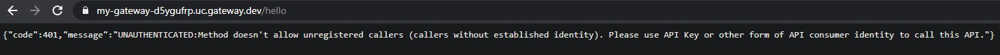
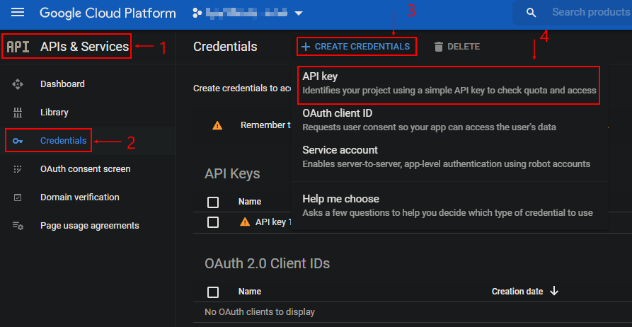
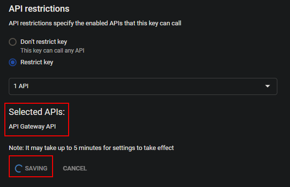
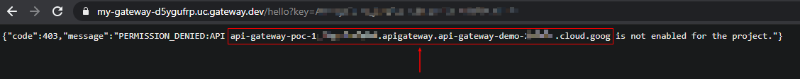
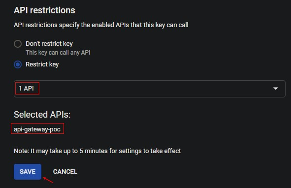
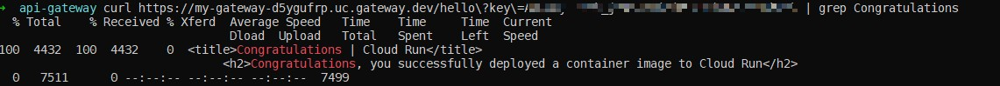

# API Gateway POC

REF: [Getting started with API Gateway and Cloud Run
](https://www.google.com/url?q=https://cloud.google.com/api-gateway/docs/get-started-cloud-run&source=gmail&ust=1602695745965000&usg=AFQjCNF9E4a0PLJf9_JzEsNR-uULhZFpVA)

**1.** Service Account Creation

~~~
gcloud iam service-accounts create <SA_NAME>
~~~

**2.** Set Service Account Permissions, Enable Services

- Services

~~~
gcloud services enable apigateway.googleapis.com
gcloud services enable servicemanagement.googleapis.com
gcloud services enable servicecontrol.googleapis.com
gcloud services enable run.googleapis.com
~~~

- Permissions

~~~
# Allow to deploy endpoint
gcloud projects add-iam-policy-binding <PROJECT_ID> \
  --member=serviceAccount:<SA_NAME>@<PROJECT_ID>.iam.gserviceaccount.com \
  --role=roles/servicemanagement.configEditor

# Allow private cloud run access
gcloud projects add-iam-policy-binding <PROJECT_ID> \
  --member=serviceAccount:<SA_NAME>@<PROJECT_ID>.iam.gserviceaccount.com \
  --role=roles/run.invoker

# Allow to use and consume endpoints
gcloud projects add-iam-policy-binding <PROJECT_ID> \
  --member=serviceAccount:<SA_NAME>@<PROJECT_ID>.iam.gserviceaccount.com \
  --role=roles/servicemanagement.serviceController
~~~

**3.** Deploy the sample app

~~~
gcloud run deploy <APP_NAME> \
    --image="gcr.io/cloudrun/hello" \
    --no-allow-unauthenticated \
    --region us-central1 \
    --platform managed \
    --project=<PROJECT_ID> \
    --service-account <SA_NAME>@<PROJECT_ID>.iam.gserviceaccount.com
~~~

**4.** Create the configuration YAML: 

~~~
# openapi2-run.yaml
swagger: '2.0'
info:
  title: api-gateway-poc
  description: Sample API on API Gateway with a Cloud Run backend
  version: 1.0.0
schemes:
  - https
produces:
  - application/json
paths:
  /hello:
    get:
      summary: Greet a user
      operationId: hello
      x-google-backend:
        address: https://hello-app-22llm3kpaa-uc.a.run.app
      responses:
        '200':
          description: A successful response
          schema:
            type: string
security:
  - api_key: []
securityDefinitions:
  api_key:
    type: "apiKey"
    name: "key"
    in: "query"          
~~~

**4.b.** Deploy the Gateway Config, where:

**CONFIG_ID** specifies the name of your API config.  
**API_ID** specifies the name of your API. If the API does not already exist then this command creates it.  
**PROJECT_ID** specifies the name of your Google Cloud project.  
**SERVICE_ACCOUNT_EMAIL** specifies the service account created explicitly for creating API configs. For more information, see Creating a service account.

~~~
gcloud beta api-gateway api-configs create CONFIG_ID \
  --api=API_ID --openapi-spec=openapi2-run.yaml \
  --project=PROJECT_ID --backend-auth-service-account=SERVICE_ACCOUNT_EMAIL
~~~

This operation may take several minutes to complete as the API config is propagated to downstream systems. Creation of a complex API config could take up to ten minutes to complete successfully.

**5.** After the API config is created, you can view its details by running this command:

~~~
gcloud beta api-gateway api-configs describe CONFIG_ID \
  --api=API_ID --project=PROJECT_ID
~~~

**6.** Now you can deploy your API on API Gateway. Deploying an API on API Gateway also defines an external URL that API clients can use to access your API.

Run the following command to deploy the API config you just created to API Gateway:

~~~
gcloud beta api-gateway gateways create GATEWAY_ID \
  --api=API_ID --api-config=CONFIG_ID \
  --location=GCP_REGION --project=PROJECT_ID
~~~

where:

**GATEWAY_ID** specifies the name of the gateway.  
**API_ID** specifies the name of the API Gateway API associated with this gateway.  
**CONFIG_ID** specifies the name of the API config deployed to the gateway.  
**GCP_REGION** is the Google Cloud region for the deployed gateway. Allowed values for the Beta are: asia-east1, europe-west1, and us-central1.  
**PROJECT_ID** specifies the name of your Google Cloud project.  

7. On successful completion, you can use the following command to view details about the gateway:

~~~
gcloud beta api-gateway gateways describe GATEWAY_ID \
  --location=GCP_REGION --project=PROJECT_ID
~~~

Output:

~~~
➜  gcloud beta api-gateway gateways describe my-gateway \
>   --location=us-central1 --project=api-gateway-demo-292419
apiConfig: projects/api-gateway-demo-292419/locations/global/apis/api-gateway-poc/configs/my-config
createTime: '2020-10-13T20:21:47.861399598Z'
defaultHostname: my-gateway-d5ygufrp.uc.gateway.dev
displayName: my-gateway
name: projects/api-gateway-demo-292419/locations/us-central1/gateways/my-gateway
state: ACTIVE
updateTime: '2020-10-13T20:24:38.945921643Z'
➜  api-gateway
~~~

**Notice** the "defaultHostname" entry that shows the URL for this API Gateway Service: my-gateway-d5ygufrp.uc.gateway.dev

- Testing the service:

URL: [my-gateway-d5ygufrp.uc.gateway.dev/hello](my-gateway-d5ygufrp.uc.gateway.dev/hello)
~~~
{"code":401,"message":"UNAUTHENTICATED:Method doesn't allow unregistered callers (callers without established identity). Please use API Key or other form of API consumer identity to call this API."}
~~~

**8.** Creating the API Key:

In the Google Cloud Platform Console go to "API & Services" > "Credentials" > "+ Create Credentials" > Select "API Key":

- Click on "Restrict Key"

- Now we can test the app again, this time with the key, notice the new error:

**9.** Enable the service, where **SERVICE_NAME** is the name of your service (the one listed on the error in the step above)

~~~
gcloud services enable SERVICE_NAME
~~~

- Now change the API Key Restriction in the step 8 for your API Gateway ID:

**10.** Now our app it's secure and working, congratulations!

